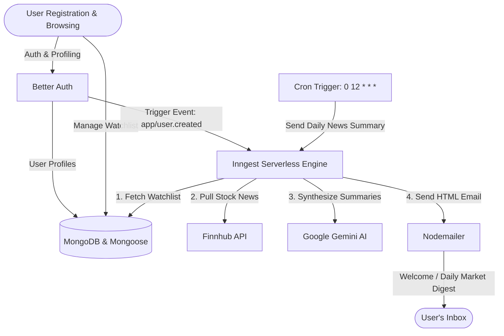

# <p align="center">📈 Stock IQ (Signalist)</p>

<p align="center">
  
  
  
  
  
</p>

Stock IQ (internally named **Signalist**) is a premium, state-of-the-art stock tracking and market intelligence platform. Built on the modern Next.js 15 app directory model, it combines live TradingView market interfaces, interactive chart analyses, customizable watchlists, and secure credentials management with automated, AI-generated newsletters powered by Google Gemini and Inngest workflows.

---

## 🌟 Key Features

### 💻 Live Dashboards
* **Market Overview:** Live interactive indices tracker for major tech, financial, and service giants.
* **Stock Heatmap:** Visual representation of sectors (such as S&P 500) sorted by market capitalization and real-time gain/loss ratios.
* **Top Stories & Quotes:** Dynamic timelines and price matrices keeping you updated on the fly.

### 📊 Stock Analysis (`/stocks/[symbol]`)
* **Dual-View Charting:** Smooth toggling between advanced TradingView candlestick layouts and baseline indicators.
* **Technical Gauge:** Live moving average consensus calculations showing market sentiment (Buy/Sell/Neutral).
* **Financial & Profile Cards:** Detailed company capitalization metrics, balance sheets, and operational overviews.

### 🔐 Unified Authentication
* **Credentials Flow:** Register, login, and verify passwords securely via Better Auth.
* **Investment Profiling:** Personalized data capture during registration including country select, investment goals, risk tolerance, and industry focus.

### 🤖 Intelligent Workflows
* **Custom Onboarding Email:** Generates a personalized welcome summary using Gemini AI based on the user's investment profile.
* **Daily Smart Newsletter:** Automatically runs via Inngest (scheduled cron at 12:00 PM daily). Retrieves user watchlists, pulls corresponding news from Finnhub, uses Google Gemini to summarize them, and fires customized emails via Nodemailer.

---

## 📐 System Architecture

The workflow and data flows are organized as follows:



---

## 📁 Project Structure

```text
├── app/                  # Next.js App Router folders and API endpoints
│   ├── (auth)/           # Authentication layout (Sign In, Sign Up pages)
│   ├── (root)/           # App homepage (Dashboard) & stocks dynamic route details page
│   └── api/
│       └── inngest/      # Inngest API serve route endpoint
├── components/           # UI Components
│   ├── ui/               # Radix UI primitives (avartar, dropdown-menu, button, dialog, command, popover, select)
│   ├── forms/            # Form selectors, country inputs, text fields
│   ├── Header.tsx        # Responsive sticky navbar
│   ├── SearchCommand.tsx # Command-K modal triggering debounced Finnhub ticker queries
│   └── WatchlistButton.tsx # Persistence toggler for user watchlists
├── database/             # Schema definitions and DB connectivity
│   ├── models/           # Mongoose Database schemas (Watchlist model)
│   └── mongoose.ts       # Singleton mongoose connector instance
├── hooks/                # Custom React hooks (useDebounce, useTradingViewWidget)
├── lib/                  # Backend code, server actions and SDK configs
│   ├── actions/          # Server Actions (Auth, Finnhub, Watchlist, Users)
│   ├── better-auth/      # Better Auth setup
│   ├── inngest/          # Inngest client definitions, functions, and Gemini prompts
│   ├── nodemailer/       # Email transport setup and templates
│   ├── constants.ts      # TradingView configs, stock symbols lists
│   └── utils.ts          # Formatting utilities and deterministic color generators
├── public/               # Asset folders (logos, design assets, and SVGs)
├── scripts/              # Command line developer tools (db connectors testing)
└── types/                # Strict TypeScript declaration types
```

---

## ⚙️ Environment Variables Setup

Create a `.env` or `.env.local` file at the root of the project and define the variables below:

| Environment Variable | Description | Example / Details |
| :--- | :--- | :--- |
| **`MONGODB_URI`** | Connection string to your MongoDB database. | `mongodb+srv://<user>:<password>@cluster.mongodb.net/stock_iq` |
| **`BETTER_AUTH_SECRET`** | Encryption secret key for Better Auth sessions. | *Must be a randomly generated 32-character string* |
| **`BETTER_AUTH_URL`** | The public-facing canonical domain address of the app. | `http://localhost:3000` |
| **`FINNHUB_API_KEY`** | Finnhub REST key for fetching stock news & search queries. | *Get key from finnhub.io/dashboard* |
| **`NODEMAILER_EMAIL`** | Sender email account for onboarding & summaries. | `signalist@gmail.com` |
| **`NODEMAILER_PASSWORD`**| App password credentials for Nodemailer mailing transport.| *Generated from Google App Passwords* |
| **`GEMINI_API_KEY`** | Google Gemini key enabling background AI summarization. | *Get key from Google AI Studio* |

> [!IMPORTANT]
> Make sure both `FINNHUB_API_KEY` and `NEXT_PUBLIC_FINNHUB_API_KEY` are provided. The client-side components utilize the `NEXT_PUBLIC_` prefix while server actions use `FINNHUB_API_KEY`.

---

## 🚀 Setup & Installation

### 1. Install Dependencies
```bash
npm install
```

### 2. Verify MongoDB Integration
Run the built-in database validation scripts to verify that your cluster is fully connected:
```bash
npm run test:db
```

### 3. Run the Inngest Dev Server
Inngest schedules background workflows and communicates with Gemini using an Inngest dev server proxy. Launch it in your terminal:
```bash
npx inngest-cli dev
```
> [!TIP]
> The local dashboard will launch at **[http://localhost:8288](http://localhost:8288)** where you can inspect triggered functions and Gemini prompt runs.

### 4. Boot Up the Development Server
```bash
npm run dev
```
The application will launch on **[http://localhost:3000](http://localhost:3000)**.

---

## 📦 Production Delivery

To create an optimized production bundle:
```bash
npm run build
```

Then, run the server in production mode:
```bash
npm run start
```

---

## 🛡️ License
This project is proprietary and confidential. All rights reserved.

